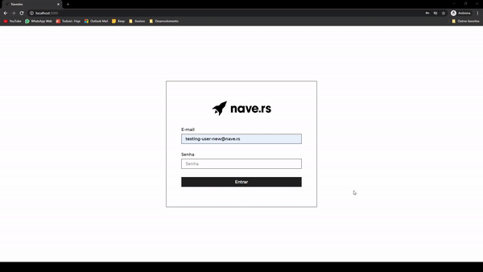

# Desafio de frontend da [Nave](https://nave.rs/)

## Rodando a aplicação
    $ yarn install
    
    $ yarn start 

  Acessar [http://localhost:3000](http://localhost:3000)

  OU

  Testar a [aplicação](https://navedex-guipolive.herokuapp.com/) hospedada no Heroku

- login e senha para testes:
    - testing-user-new@nave.rs
    - 1234nave5
## Sobre o desafio

O sistema consiste em uma web app para visualização e criação dos navers, possuindo informações como nome, idade, cargo, tempo de empresa e projetos que participou.

## Funcionalidades

- ### Login

    A web app possui um fluxo de autenticação, onde o usuário só pode acessar as telas internas do sistema (listagem, formulários) passando pela tela de login com as credenciais aceitas.

- ### Visualização de dados
    É possível visualizar os `naver's` na `home` e ao clicar em cima da imagem de um `naver` na `home`. 

- ### Edição de dados
    É possível alterar os dados de um `naver` ao clicar no ícone de edição na `home` ou a partir da modal de visualização de um `naver`.

- ### Criação de dados
    É possível criar um `naver` a partir do botão da tela inicial: `Adicionar naver`.

## Sobre o desenvolvimento
O desenvolvimento da aplicação foi feito utilizando ```Typescript``` e ```React.JS```.

Para a integração com a API foi utilizado o `Axios` .

Alguns elementos foram convertidos em ```componentes react``` para reutilização no código.

## Dificuldades
  - Foi gasto algum tempo no desenvolvimento para descobrir o que de fato era esperado pela `API` no campo `birthday` e `admission_date`, porque este campo era recebido em um formato pela `API`, mas era enviado em outro formato nas requisições.
    - No fim das contas, eu envio uma data no formato ```DD/MM/YYYY``` e converto o tempo decorrido para melhor exibição da ```idade``` e ```tempo de empresa```.

## Funcionalidades extras
- Tema escuro!
- Redirecionamento automático para ```/``` caso o usuário não esteja logado e tente acessar alguma rota que exija login.
- Sessão guardada nos cookies do navegador.
- Tema escuro guardado no ```localStorage``` do navegador

